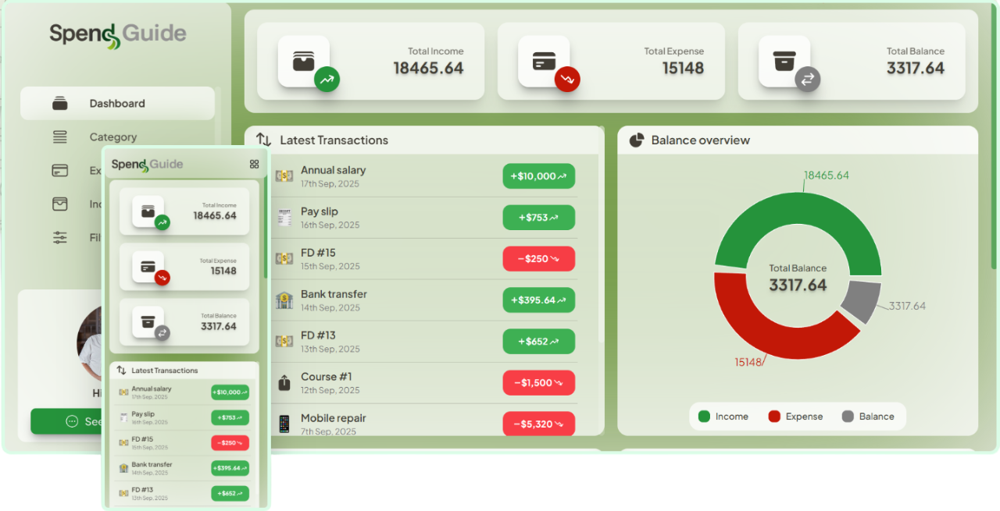

<!-- Logo -->
# **Frontend of**


<div style="display: flex; align-items: center; justify-content: center;">

[](https://www.netlify.com/)
[](LICENSE)

</div>

#

<!-- Screenshots -->
<div 
    style="display:flex; flex-direction: column; align-items: center; justify-content: between; width: 100%;padding-bottom: 65px;" 
>
    <div style="display:flex; flex-direction: column; align-items: center; justify-content: between; width: 100%;">
        
    </div>
</div>

## This repo contains the **frontend** of the **Spend Guide** application built with **React.js**
It provides a user-friendly responsive interface to track incomes, expenses with graph and charts to visualize spending pattern.

Check out the live demo of the app: [Spend Guide↗](https://spend-guide.netlify.app/)
> IMP: Might took some time(around 2-3 mins) for first response in a while from the backend due to the limitation of [Render↗](https://render.com/) free instance.

- ### Features:

    1. Add, delete, modify entry logs of **incomes**, **expenses** and **categories**.
    2. User authentication using **JSON web token**.
    3. Interactive charts to **visualize** spending pattern.
    4. **Export/Download** transaction datas.
    5. Responsive UI with **tailwind CSS**.
    6. Integrated Spring Boot **REST API** backend.

---

- ### Tech stack used:

    * [](https://vite.dev/guide/)
    * [](https://react.dev/learn)
    * [](https://recharts.org/en-US)
    * [](https://react-hot-toast.com/)
    * [](https://reactrouter.com/home)
    * [](https://tailwindcss.com/)

---

- ### Local Installation and Setup Guide:

    1. Clone the repository:
        ```
            git clone https://github.com/<your_username>/spend-guide-frontend.git
        ```

    2. Install all dependencies:
        ```
            npm install
        ```

    3. Create a ```.env``` file:
        - For that, open an account in [Cloudinary↗](https://cloudinary.com/)
        - Note down the **name** from the **upload presets**.
        - And, note down the last string after **@** in **API keys** section.
        - Make those two as two environment variables:
            ```
                VITE_IMG_UPLOAD_CLOUDINARY=https://api.cloudinary.com/v1_1/<your_string_value>/image/upload
                VITE_UPLOAD_PRESET_CLOUDINARY=<your_upload_presets_name>
            ```
        - Create another environment vaiable for backend API(After running it locally):
            ```
                VITE_API_BASE_URL=http://localhost:8080/api/v1
            ```
        > For more details checkout the [official documentation of Cloudinary↗](https://cloudinary.com/documentation/upload_images#unauthenticated_requests)

    4. Run the development server in the terminal:
        ```
            npm run dev
        ```

---

## **🤝 Contributing**
### Pull request are always welcome.
### For major changes, please open an issue first to discuss what do you like to change.